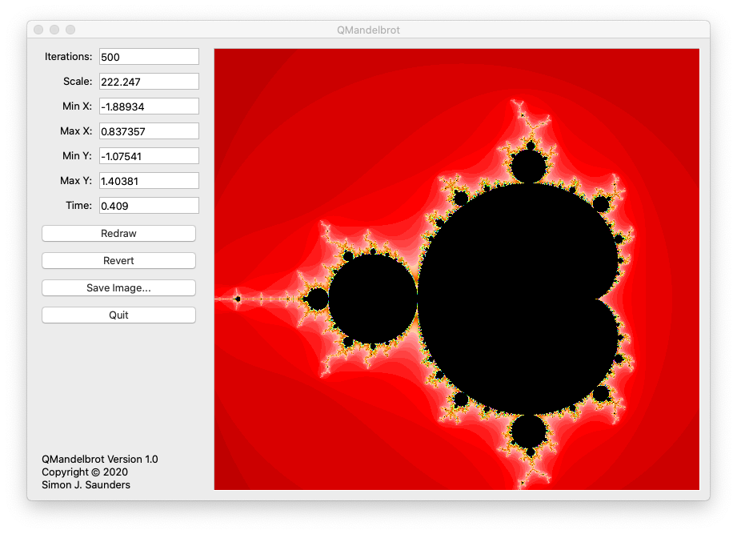

README file for QMandelbrot 1.0
==============================

QMandelbrot is a program for visualising the Mandelbrot set.
Images can be saved for use as desktop backgrounds, for example.
My motivation for writing it was to learn about Qt programming.

QMandelbrot is licensed under the GPL v3. See LICENSE for details.

Building QMandelbrot
-------------------
Open the file mandelbrot.pro in Qt Designer or run qmake to generate a Makefile.
Obviously you'll need to install Qt first!

Installing QMandelbrot
---------------------
There is no installer as yet.

Simon J. Saunders, February 2020
